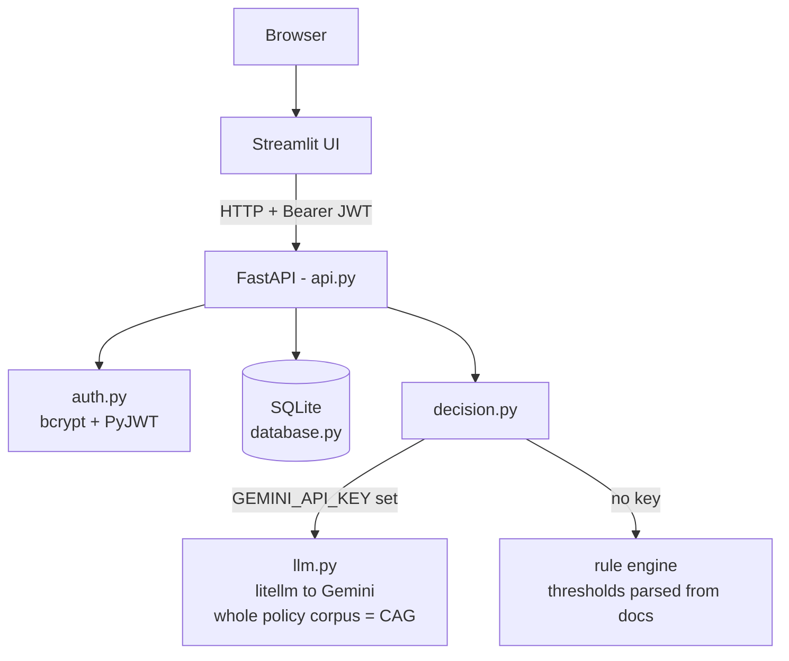
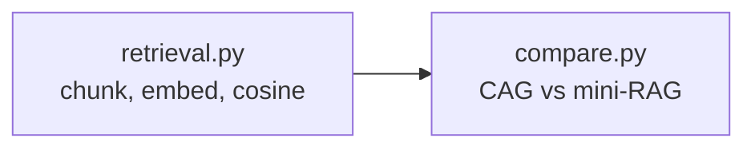

# Support Ticket Decision Assistant

Implemented multi-tenant isolation: every account is its own workspace, and all ticket and decision queries are tenant-scoped, so one user can never read another's data. The rest of the design:

- Two decision paths, always attributable. Gemini (via litellm) reads the whole policy corpus in one call (CAG); with no key configured, a deterministic rule engine answers instead. Every decision records which path answered (`path` in the response and the DB).
- Every model answer passes four gates: JSON schema, a citation check against the supplied policy context, a thin-context guard, and a confidence cap. The model can talk itself down but never up.
- No threshold is typed anywhere in `src/`. Every rupee value and day window is parsed out of a numbered rule in a policy document, and a policy edit changes the fingerprint and invalidates the cache.
- Ticket text is wrapped as untrusted data, and instruction-like sequences are redacted before the model sees them.
- Facts written in prose count. Rupee amounts and "N days ago" in the message fill blank form fields; typed values are never overridden.
- Failure never fabricates. A configured model that fails returns a 503 and stores nothing; the rule engine never silently takes its place.
- Small stack on purpose: FastAPI, JWT auth (bcrypt + PyJWT), SQLite with WAL (no ORM), Streamlit, litellm. No vector DB, no LangChain.
- The mini-RAG benchmark (`retrieval.py` + `compare.py`) runs offline, for evaluation only; the serving code never imports it.

Submit a customer support ticket, get back a structured decision: action, confidence, reason, sources.

## What it does

1. Register / login, get a JWT. All data is isolated per account.
2. Submit a ticket (the message is the only required field).
3. The whole policy corpus goes into one Gemini call (CAG) → validated, citation-checked decision.
4. No API key? A deterministic rule engine answers instead. Every decision records which path answered (`path` in the response and DB).
5. Tickets + decisions are stored per user. Users can only read their own.
6. Each answer reports the action, a confidence score, the reason in policy terms, and the policy files it leaned on.

## Architecture



Every decision records which path answered (`path` in the response and DB).

The benchmark is a separate offline path that the serving code never touches:



`decision.py` never imports `retrieval.py`.

## Folder structure

```
├── streamlit_app.py        # frontend (HTTP only)
├── .streamlit/config.toml  # UI theme (fonts, colors)
├── src/
│   ├── api.py              # 6 endpoints, no business logic
│   ├── auth.py             # bcrypt hashing, JWT issue/verify
│   ├── database.py         # schema, WAL, tenant-scoped queries
│   ├── models.py           # pydantic request/response shapes
│   ├── decision.py         # CAG call + rule engine + validation
│   ├── cache.py            # policy loading, prefix, fingerprint
│   ├── retrieval.py        # chunk/embed/rank (benchmark only)
│   ├── evaluate.py         # runs the supplied test cases
│   ├── compare.py          # CAG vs mini-RAG side by side
│   ├── llm.py              # the only place litellm is called
│   └── config.py           # env, paths, action vocabulary
├── knowledge_base/         # supplied policy markdown (untouched)
├── data/
│   ├── tickets.csv         # supplied historical tickets
│   └── boundary_probe.json # threshold-straddling test pairs
├── sample_test_cases.json  # supplied eval cases
└── tests/test_app.py       # 8 scenario tests, no API key needed
```

## Setup

```bash
uv sync
cp .env.example .env
# put your own key in .env:
#   GEMINI_API_KEY=your-key        (https://aistudio.google.com/apikey)
#   JWT_SECRET=some-random-string
```

No key in `.env`? The app still works — the rule engine answers and records `path="fallback"`.

## Run

```bash
uv run uvicorn src.api:app --host 127.0.0.1 --port 8000   # API (docs at /docs)
uv run streamlit run streamlit_app.py                      # UI on :8501
```

## Test

```bash
uv run pytest                      # 8 scenario tests, keyless
uv run python -m src.evaluate      # required accuracy report
uv run python -m src.compare       # CAG vs retrieval benchmark (needs key)
uv run python -m src.decision      # per-module self-checks: also src.config, src.cache,
                                   # src.database, src.auth, src.models, src.retrieval
```
